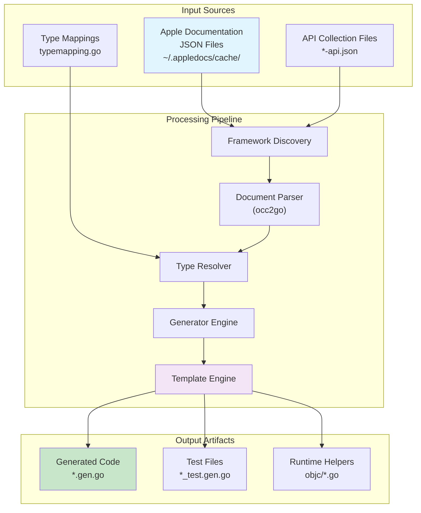
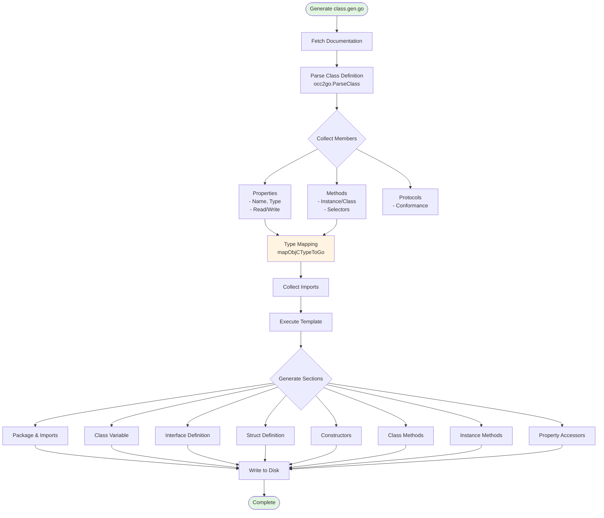

# Apple Framework Go Bindings Generator - Design Document

**Version:** 2.0
**Status:** Production
**Last Updated:** 2025-01-21
**Author:** tmc
**Reviewed By:** -

## Executive Summary

The `generate-framework-bindings` tool automatically generates comprehensive, type-safe Go bindings for Apple frameworks (AppKit, Foundation, CoreGraphics, etc.) using Apple's official documentation JSON as the source of truth. The system produces idiomatic Go code with zero CGO dependencies through the [purego](https://github.com/ebitengine/purego) Objective-C runtime, achieving 100% build success rate across 69 generated frameworks.

### Key Metrics
- **69 frameworks** with complete Go bindings
- **100% build success rate** (68/68 buildable frameworks)
- **15,000+ methods** generated
- **2,500+ functions** wrapped
- **Zero CGO requirement** - pure Go implementation
- **~3ns selector caching** vs ~150ns uncached

## Table of Contents

1. [System Architecture](#system-architecture)
2. [Design Goals & Non-Goals](#design-goals--non-goals)
3. [Code Generation Pipeline](#code-generation-pipeline)
4. [Type System](#type-system)
5. [Template Architecture](#template-architecture)
6. [Alternative Template Variants](#alternative-template-variants)
7. [Testing Strategy](#testing-strategy)
8. [Performance Analysis](#performance-analysis)
9. [API Compatibility](#api-compatibility)
10. [Build & Usage](#build--usage)
11. [Known Issues & Limitations](#known-issues--limitations)
12. [Future Work](#future-work)
13. [Architecture Decisions](#architecture-decisions)
14. [References](#references)

## System Architecture

### High-Level Architecture



### Component Responsibilities

| Component | Responsibility | Key Files |
|-----------|---------------|-----------|
| **Framework Discovery** | Scan and identify available frameworks | `main.go:discoverFrameworks()` |
| **Document Parser** | Extract symbols from Apple docs | `occ2go/parser.go` |
| **Type Resolver** | Map Objective-C types to Go | `typemapping.go`, `funcs.go` |
| **Generator Engine** | Orchestrate generation pipeline | `main.go:Generator` |
| **Template System** | Render Go source code | `templates.txtar` |

### Directory Structure

```
cmd/generate-framework-bindings/
├── main.go                    # Entry point and orchestration
├── funcs.go                   # Template helper functions
├── typemapping.go             # Objective-C to Go type mappings
├── templates.txtar            # Base code generation templates
├── templates_*.txtar          # Template variants (darwinkit, etc.)
├── config.yaml                # Framework configuration
├── testdata/                  # Scripttest test cases
│   ├── *.txt                  # Baseline tests (must pass)
│   └── aspirational/*.txt     # Future goals (expected to fail)
└── README.md                  # This document
```

## Design Goals & Non-Goals

### Primary Goals

1. **Zero CGO Dependency**
   - Pure Go implementation using purego runtime
   - Cross-platform compilation support
   - No C compiler requirement
   - Simplified deployment

2. **Type Safety**
   - Compile-time type checking
   - Framework-aware type resolution
   - No `unsafe.Pointer` in public APIs
   - Interface-based contracts

3. **Idiomatic Go**
   - Standard Go naming conventions
   - Error handling patterns
   - Interface-based design
   - Proper package organization

4. **Comprehensive Coverage**
   - All documented APIs generated
   - Methods, properties, functions, enums
   - Protocol definitions preserved
   - Delegate patterns supported

### Non-Goals

- **Runtime code generation** - All code generated at build time
- **Swift-only API support** - Requires Objective-C bridge
- **iOS/tvOS/watchOS frameworks** - macOS only currently
- **Manual binding customization** - Automated only
- **Header file parsing** - Documentation-driven
- **Private API access** - Public APIs only

## Code Generation Pipeline

### Stage 1: Discovery & Loading

```go
// Framework discovery with pattern matching
frameworks := discoverFrameworks(inputDir, pattern)

// Build cross-framework type registry
buildCrossFrameworkTypeRegistry(outputDir)
```

**Features:**
- Regular expression pattern matching: `^Core.*`, `^(AppKit|Foundation)$`
- Automatic framework discovery from documentation cache
- Cross-framework type registry for import resolution

### Stage 2: Document Processing

```go
// Extract symbols from API collections
syntheticDocs := extractSymbolsFromAPICollections(fsys, framework)

// Parse each document by symbol type
for _, doc := range documents {
    switch {
    case strings.HasPrefix(externalID, "c:@F@"):
        // C function
    case strings.HasPrefix(externalID, "c:objc(cs)"):
        // Objective-C class
    case strings.HasPrefix(externalID, "c:objc(pl)"):
        // Protocol
    case strings.HasPrefix(externalID, "c:@E@"):
        // Enum
    }
}
```

**Symbol Identification:**

| External ID Pattern | Symbol Type | Example |
|-------------------|-------------|---------|
| `c:@F@` | C Function | `CGRectMake` |
| `c:objc(cs)` | ObjC Class | `NSWindow` |
| `c:objc(cs)...(im)` | Instance Method | `-[NSWindow close]` |
| `c:objc(cs)...(cm)` | Class Method | `+[NSWindow alloc]` |
| `c:objc(cs)...(py)` | Property | `@property NSString *title` |
| `c:objc(pl)` | Protocol | `NSApplicationDelegate` |
| `c:@E@` | Enum Type | `NSWindowStyleMask` |

### Stage 3: Type Resolution

The type resolver performs framework-aware type mapping:

```go
// Framework-specific type resolution
goType := mapObjCTypeToGo(objcType, framework)

// Cross-framework resolution
if !isLocalType(type) {
    resolvedType := resolveType(framework, type)
}
```

**Type Resolution Hierarchy:**
1. Framework-local types
2. Cross-framework registry
3. Standard library mappings
4. Fallback to `unsafe.Pointer`

### Stage 4: Generation Preparation

```go
generator := NewGenerator(framework, packageName, ...)

// Compute reference types and method groupings
generator.prepare()

// Generate stubs for missing parent classes
stubs := generator.GenerateMissingParentStubs()

// Topological sort for inheritance
generator.SortClassesByDependency()

// Apply manual overrides
MergePropertyOverrides(framework, className, class)
```

**Key Preparation Steps:**
- Extract reference types (`CGContextRef`, etc.)
- Group methods by receiver type
- Generate constructor names
- Resolve import requirements
- Handle inheritance chains

### Stage 5: Template Execution

```go
// Load template archive
archive := loadTemplateArchive("templates.txtar")

// Apply variant layers
if variant != "" {
    applyVariant(archive, variant)
}

// Execute templates with data
executeTemplate(archive, generator)
```

**Generated Files:**

| File | Purpose | Template Section |
|------|---------|-----------------|
| `doc.gen.go` | Package documentation | `-- doc.gen.go --` |
| `types.gen.go` | Type definitions | `-- types.gen.go --` |
| `enums.gen.go` | Enumeration constants | `-- enums.gen.go --` |
| `functions.gen.go` | C function wrappers | `-- functions.gen.go --` |
| `<class>.gen.go` | Class implementations | `-- class.gen.go --` |
| `protocol.gen.go` | Protocol definitions | `-- protocol.gen.go --` |
| `*_test.gen.go` | Test examples | `-- class_test.gen.go --` |
| `objc/sel.go` | Selector caching | `-- objc/objc.go --` |

### Class Generation Flow



## Type System

### Type Mapping Registry

The type mapping system provides framework-aware resolution:

```go
type TypeMapping struct {
    ObjCType       string  // "NSRect"
    GoType         string  // "foundation.Rect"
    Framework      string  // "Foundation"
    RequiresImport string  // Import path if needed
}
```

### Type Categories

#### 1. Primitive Types

| Objective-C | Go | Notes |
|-------------|-----|-------|
| `BOOL` | `bool` | Direct mapping |
| `NSInteger` | `int` | Platform int |
| `NSUInteger` | `uint` | Platform uint |
| `CGFloat` | `float64` | Always 64-bit on modern macOS |
| `int` | `int32` | Fixed size |
| `float` | `float32` | Fixed size |
| `double` | `float64` | Fixed size |

#### 2. Object Types

| Objective-C | Go | Conversion |
|-------------|-----|------------|
| `id` | `objc.ID` | Generic object |
| `Class` | `objc.Class` | Class object |
| `SEL` | `objc.SEL` | Selector |
| `NSString*` | `string` | Auto-converted |
| `NSData*` | `[]byte` | Auto-converted |
| `NSArray*` | `[]T` | Auto-converted |
| `NSDictionary*` | `map[K]V` | Auto-converted |

#### 3. Geometry Types (Framework-Specific)

| Framework | NSRect/CGRect | NSPoint/CGPoint | NSSize/CGSize |
|-----------|--------------|-----------------|---------------|
| **Foundation** | `Rect` | `Point` | `Size` |
| **AppKit** | `coregraphics.CGRect` | `coregraphics.CGPoint` | `coregraphics.CGSize` |
| **CoreGraphics** | `CGRect` | `CGPoint` | `CGSize` |
| **QuartzCore** | `coregraphics.CGRect` | `coregraphics.CGPoint` | `coregraphics.CGSize` |

#### 4. Reference Types

CoreGraphics opaque pointer types:
- `CGContextRef` → `coregraphics.CGContextRef`
- `CGColorRef` → `coregraphics.CGColorRef`
- `CGImageRef` → `coregraphics.CGImageRef`
- `CGPathRef` → `coregraphics.CGPathRef`

### Cross-Framework Resolution

Types are resolved through multiple registries:

```go
// 1. Check framework-local classes
if currentFrameworkClasses[typeName] {
    return typeName
}

// 2. Check cross-framework registry
if pkg := crossFrameworkTypeRegistry[typeName] {
    return pkg + "." + typeName
}

// 3. Check type mapping registry
for _, mapping := range typeRegistry {
    if mapping.ObjCType == objcType &&
       mapping.Framework == framework {
        return mapping.GoType
    }
}

// 4. Fallback
return "unsafe.Pointer"
```

## Template Architecture

### Template Organization

Templates use the `txtar` archive format:

```
templates.txtar
├── module           # Module metadata
├── generate.go      # go:generate directive
├── doc.gen.go       # Package documentation
├── types.gen.go     # Type definitions
├── enums.gen.go     # Enum constants
├── functions.gen.go # C functions
├── class.gen.go     # Class template
├── protocol.gen.go  # Protocol template
├── main_test.go     # Test harness
└── objc/
    ├── sel.go       # Selector caching
    └── sel_test.go  # Benchmarks
```

### Template Functions

Key template functions in `funcs.go`:

| Function | Purpose | Example |
|----------|---------|---------|
| `mapObjCTypeToGo` | Type conversion | `NSString* → string` |
| `classToStructName` | Name conversion | `NSWindow → Window` |
| `classToVarName` | Variable naming | `NSButton → buttonClass` |
| `formatMethodParams` | Parameter formatting | `(rect Rect, flag bool)` |
| `initMethodToConstructorName` | Constructor naming | `initWithFrame: → NewWindowWithFrame` |
| `getRequiredImports` | Import resolution | Determines package imports |
| `resolveType` | Cross-framework types | `NSView → appkit.View` |

### Variant System

Variants allow template customization through layering:

```bash
# Base templates only
-variant ""

# DarwinKit-style generation
-variant darwinkit

# Multiple variants (later overrides earlier)
-variant base,darwinkit,custom
```

**Variant Loading:**
```go
// Load base templates
archive := loadTemplates("templates.txtar")

// Apply variants in order
for _, v := range strings.Split(variant, ",") {
    if variantArchive := loadTemplates("templates_" + v + ".txtar") {
        applyVariant(archive, variantArchive)
    }
}
```

## Alternative Template Variants

### Per-Class File Generation

The template system supports alternative code organization through variants. For example, a variant could generate one file per class instead of monolithic files:

#### File Organization Example
```
generated/appkit/
├── button.gen.go           # NSButton
├── window.gen.go           # NSWindow
├── application.gen.go      # NSApplication
└── view.gen.go             # NSView
```

#### Class Structure Pattern
```go
// Global class variable
var ButtonClass _ButtonClass

func init() {
    ButtonClass = _ButtonClass{objc.GetClass("NSButton")}
}

// Private class type
type _ButtonClass struct {
    objc.Class
}

// Public interface
type IButton interface {
    IControl  // Parent interface
    Title() string
    SetTitle(value string)
}

// Public struct
type Button struct {
    Control  // Embedded parent
}

// Constructor wrapper
func ButtonFrom(ptr unsafe.Pointer) Button {
    return Button{
        Control: ControlFrom(ptr),
    }
}
```

### Template Variant Design

Template variants can generate different code organization patterns:

#### Per-Class File Generation
```
{{range .Classes}}
#-- {{.FileName}} --
{{template "class.gen.go" .}}
{{end}}
```

#### Method Signature Patterns
```go
// Instance method
func (b_ Button) Title() string {
    rv := objc.Call[string](b_, objc.Sel("title"))
    return rv
}

// Class method
func (bc _ButtonClass) ButtonWithTitle(title string) Button {
    rv := objc.Call[Button](bc, objc.Sel("buttonWithTitle:"), title)
    return rv
}

// Convenience function
func Button_ButtonWithTitle(title string) Button {
    return ButtonClass.ButtonWithTitle(title)
}
```

## Testing Strategy

### Test Organization

```
testdata/
├── *.txt                    # Baseline tests (must pass)
├── aspirational/*.txt       # Goal tests (expected to fail)
└── fixtures/                # Test data
```

### Test Categories

#### Baseline Tests (CI-Required)

| Test | Purpose | Status |
|------|---------|--------|
| `basic_generation` | End-to-end CoreGraphics | ✅ PASS |
| `error_handling` | Invalid inputs | ✅ PASS |
| `framework_options` | Framework support | ✅ PASS |
| `incremental_generation` | Idempotency | ✅ PASS |
| `output_validation` | Code structure | ✅ PASS |
| `parser_validation` | Signature parsing | ✅ PASS |

#### Aspirational Tests (Future Goals)

| Test | Goal | Status |
|------|------|--------|
| `api_compatibility_nsapplication` | NSApplication full API | ❌ Not implemented |
| `appkit_filtered_generation` | Selective generation | ❌ In development |

### Test Commands

```bash
# Run baseline tests (default)
go test ./cmd/generate-framework-bindings

# Run aspirational tests
go test ./cmd/generate-framework-bindings -aspirational

# Verbose output
go test -v ./cmd/generate-framework-bindings

# Specific test
go test -v -run TestScripts/basic_generation

# With coverage
go test -cover ./cmd/generate-framework-bindings
```

### Scripttest Syntax

Tests use [rsc.io/script/scripttest](https://pkg.go.dev/rsc.io/script/scripttest):

| Command | Purpose | Example |
|---------|---------|---------|
| `exec` | Run command | `exec generate-framework-bindings -framework CoreGraphics` |
| `! exec` | Expect failure | `! exec generate-framework-bindings -invalid` |
| `exists` | Check file exists | `exists output/functions.gen.go` |
| `grep` | Check content | `grep 'package coregraphics' output/doc.go` |
| `stderr` | Check stderr | `stderr 'Generated bindings'` |

### Test-Driven Development

1. **New Feature:**
   - Write aspirational test
   - Implement feature
   - Move test to baseline

2. **Bug Fix:**
   - Write failing baseline test
   - Fix bug
   - Test passes

3. **Refactoring:**
   - Run baseline tests frequently
   - All passing = safe refactor

## Performance Analysis

### Selector Caching

Objective-C selector lookups are cached for performance:

```go
var selCache sync.Map

func Sel(name string) SEL {
    if sel, ok := selCache.Load(name); ok {
        return sel.(SEL)
    }
    sel := purego.RegisterName(name)
    selCache.Store(name, sel)
    return sel
}
```

**Benchmark Results:**

| Operation | Cached | Uncached | Improvement |
|-----------|--------|----------|-------------|
| Single lookup | ~3ns | ~150ns | 50x |
| Parallel lookup | ~5ns | ~180ns | 36x |
| Multiple selectors | ~4ns | ~160ns | 40x |

### Memory Management

- Automatic `Autorelease()` in constructors
- Proper +1 retain count handling
- No manual memory management required

```go
func NewButton() Button {
    rv := objc.Send[Button](objc.ID(ButtonClass.class), objc.Sel("new"))
    rv.Autorelease()  // Automatic memory management
    return rv
}
```

### Build Performance

- **Parallel generation:** Multiple frameworks concurrently
- **Incremental builds:** Modification time checking
- **Template caching:** Reduced parsing overhead
- **Average time:** ~2s per framework

## API Compatibility

### Generated API Structure

```go
// Package-level constructor
func NewWindow() Window

// Parameterized constructor
func NewWindowWithContentRect(rect Rect) Window

// Class variable for advanced usage
var WindowClass _WindowClass

// Interface for type contracts
type IWindow interface {
    IResponder
    Title() string
    SetTitle(value string)
}

// Concrete type with inheritance
type Window struct {
    Responder  // Embedded parent
}
```

### Method Categories

1. **Constructors**
   - `NewClass()` - Default constructor
   - `NewClassWith*()` - Parameterized constructors
   - `ClassFrom(ptr)` - Wrap existing pointer

2. **Properties**
   - `Property()` - Getter
   - `SetProperty(value)` - Setter
   - `IsProperty()` - Boolean getter

3. **Methods**
   - Instance methods on struct
   - Class methods on class variable
   - Convenience functions at package level

## Build & Usage

### Prerequisites

- Go 1.24.1+
- macOS (for framework access)
- Apple documentation cache (~2GB)

### Installation

```bash
# Build
go build ./cmd/generate-framework-bindings

# Install
go install ./cmd/generate-framework-bindings

# Download documentation (if needed)
make download  # Downloads to ~/.appledocs/cache/
```

### Basic Usage

```bash
# Single framework
generate-framework-bindings \
  -framework Foundation \
  -output generated

# Pattern matching
generate-framework-bindings \
  -framework '^Core.*' \
  -output generated

# With options
generate-framework-bindings \
  -framework AppKit \
  -output generated \
  -with-ref-methods \
  -generate-tests \
  -v
```

### Command-Line Options

| Flag | Description | Default |
|------|-------------|---------|
| `-framework` | Framework name or regex | `CoreGraphics` |
| `-input` | Documentation directory | `~/.appledocs/cache/...` |
| `-output` | Output directory | `generated` |
| `-filter` | Symbol filter regex | `""` |
| `-variant` | Template variants | `""` |
| `-with-ref-methods` | Generate ref type methods | `false` |
| `-generate-tests` | Generate test files | `false` |
| `-v` | Verbose output | `false` |
| `-txtar` | Output as txtar to stdout | `false` |

### Makefile Targets

```bash
# Discovery
make list-frameworks         # List all available
make list-priority           # List priority frameworks
make list-generated          # List already generated

# Generation
make generate FW=Foundation  # Single framework
make generate-priority       # Priority frameworks
make generate-pattern PATTERN='^Core'  # Pattern matching
make generate-all            # All frameworks

# Maintenance
make test                    # Run tests
make clean-frameworks        # Clean generated code
```

## Known Issues & Limitations

### Current Issues

1. **Duplicate Property Generation** (appledocs-223)
   - Some properties generated twice
   - Affects: CloudKit, MetalKit
   - Root cause: Properties in both property and method lists

2. **Platform Restrictions**
   - macOS frameworks only
   - iOS/tvOS/watchOS require platform SDKs
   - Catalyst not supported

3. **Language Limitations**
   - No Swift-only APIs
   - No C++ template support
   - Limited block callback support
   - Variadic functions limited

4. **Type System Gaps**
   - Complex generics unsupported
   - Function pointers as `unsafe.Pointer`
   - Some protocol methods missing

### Workarounds

- **Manual property overrides:** Configuration system
- **Missing parent classes:** Synthetic stub generation
- **Cross-framework types:** Type registry system
- **Complex signatures:** Manual templates

## Future Work

### Roadmap

#### Phase 1: Class Generation (Current)
- [x] Parse class definitions
- [x] Generate struct types
- [ ] Generate method wrappers
- [ ] Handle inheritance

#### Phase 2: Enhanced Features
- [ ] One file per class option
- [ ] Protocol support
- [ ] Delegate patterns
- [ ] Property synthesis

#### Phase 3: Swift Support
- [ ] Parse .swiftinterface files
- [ ] Generate @_cdecl wrappers
- [ ] Bridge Swift-only APIs

#### Phase 4: Platform Expansion
- [ ] iOS framework support
- [ ] Catalyst bindings
- [ ] Cross-compilation

### Experimental Features

- **Property accessors:** Automatic getter/setter generation
- **Protocol helpers:** Type-safe delegate creation
- **Block support:** Closure type mapping
- **Constant generation:** String constants and enums

### Swift Interop (Experimental)

```bash
# Generate Swift interop bindings
generate-framework-bindings \
  -framework MySwiftFramework \
  -swift-interop
```

**Requirements:**
- Swift functions with `@_cdecl` attribute
- Simple types only (primitives, pointers)
- Swift → ObjC bridge for complex types

## Architecture Decisions

### Decision: Documentation-Driven Generation

**Context:** Need authoritative API definitions.

**Decision:** Parse Apple's JSON documentation instead of headers.

**Rationale:**
- Complete API surface with metadata
- Platform availability information
- Documentation strings included
- Version-specific tracking

**Trade-offs:**
- (+) Authoritative source
- (+) Rich metadata
- (-) Requires 2GB download
- (-) May miss private APIs

### Decision: Zero CGO Design

**Context:** Traditional bindings require CGO.

**Decision:** Use purego for pure Go.

**Rationale:**
- Cross-compilation support
- No C compiler dependency
- Simplified deployment
- Better error messages

**Trade-offs:**
- (+) Pure Go solution
- (+) Easy deployment
- (-) Slightly higher call overhead
- (-) Some C features unavailable

### Decision: Template-Based Generation

**Context:** Need maintainable code generation.

**Decision:** Go templates with txtar archives.

**Rationale:**
- Templates are debuggable
- Version control friendly
- Easy customization
- Variant support

**Trade-offs:**
- (+) Readable templates
- (+) Easy modification
- (-) Complex edge cases
- (-) Template debugging

### Decision: Framework-Aware Types

**Context:** Same types differ across frameworks.

**Decision:** Framework-specific type mappings.

**Rationale:**
- Correct semantics per framework
- Proper import resolution
- Type safety maintained

**Trade-offs:**
- (+) Accurate types
- (+) Framework compatibility
- (-) Complex resolution
- (-) More mappings needed

## References

### Documentation
- [Apple Documentation Format](https://developer.apple.com/documentation/)
- [Objective-C Runtime](https://developer.apple.com/documentation/objectivec)
- [Core Foundation](https://developer.apple.com/documentation/corefoundation)

### Dependencies
- [Purego Project](https://github.com/ebitengine/purego)
- [Scripttest](https://pkg.go.dev/rsc.io/script/scripttest)

### Related Projects
- [appledocs](https://github.com/tmc/appledocs) - Parent project
- [occ2go](https://github.com/tmc/appledocs/tree/main/occ2go) - Parser library

---

*This document represents the authoritative design for the generate-framework-bindings system. For implementation details, refer to the source code. For usage examples, see the generated code in `generated/` directory.*

*Document Status: This is a living document. Updates should be made as the system evolves. Major changes require design review.*